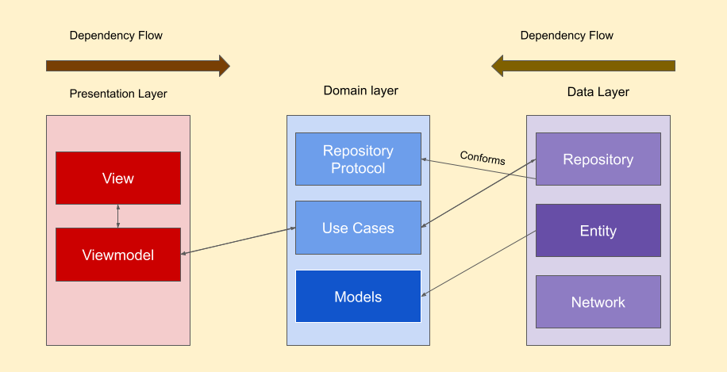
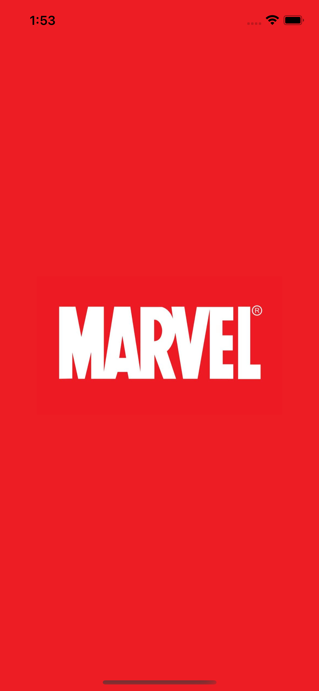
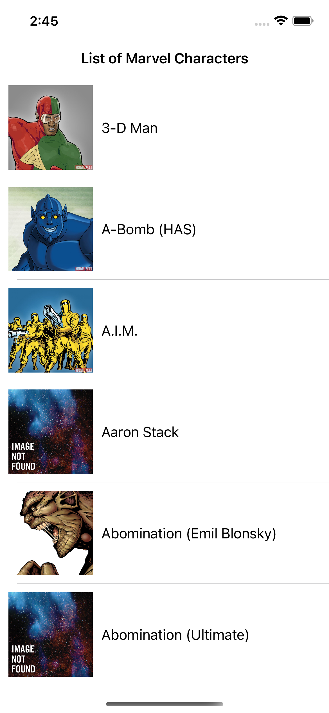
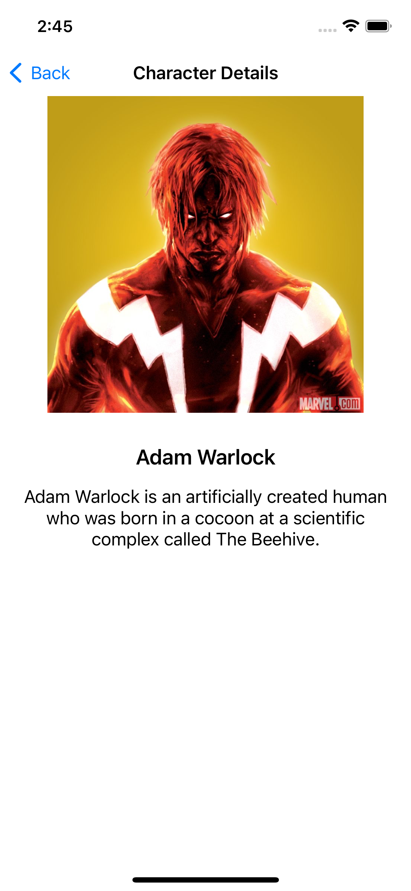

# MarvelCharacters
A list of Marvel characters and allows the user to see the detailed info of each character individually.

## Architecture
We divided the app code into different folder which act as logical units. Each unit have their own responsibility and behaviour. All components communication is done using abstraction. 
This app divided into below folder structure:
This diagram will illustrate high level implementation of architecture

### Layers
* **Presentation Layer (MVVM)** = ViewModels + Views
Presentation Layer contains UI (UIViewControllers or SwiftUI Views). Views are coordinated by ViewModels (Presenters) which execute one or many Use Cases. Presentation Layer depends only on the Domain Layer.

* **Domain Layer** = Entities + Use Cases + Repositories Interfaces
Domain Layer is the inner-most part i.e. without dependencies to other layers, it is totally isolated. It contains Entities, Use Cases, and Repository Interfaces. This layer could be potentially reused within different projects.

* **Data Layer** = Repositories Implementations + API (Network)
Data Layer contains Repository Implementations and one or many Data Sources. Repositories are responsible for coordinating data from different Data Sources.

### Testing
* Under Data module, we have written unit test cases for Repositories and Entities.
* Under Domain module, we have written unit test cases for UseCases.
* Under Presentation module, we have written unit test cases View Models.

##### To run this project on local machine Open MarvelCharacters.xcodeproj file and wait till required swift packages loading done.
#### Dependencies added for via SPM (Swift Package Manager): 
* Moya: for network calls
* Kingfisher: for loading images from remote url

Sample screenshots of all app screens..

 

